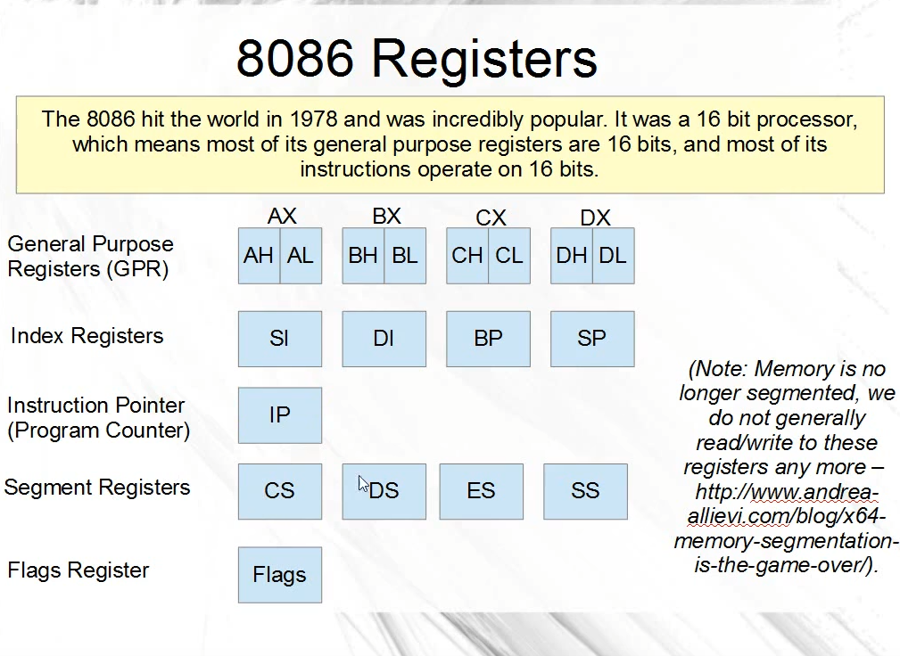
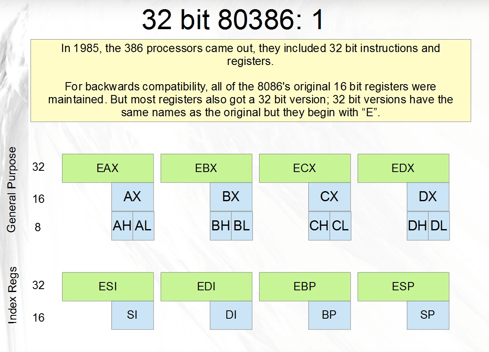
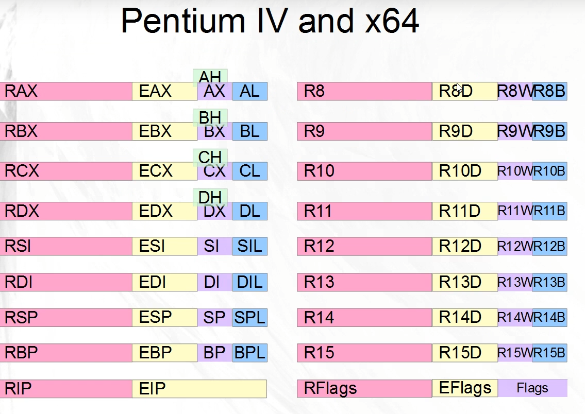

## low level learning video notes

### 3 different operations

#### 3.1 moving the value `8` into the x64 register `rdi`

```nasm
mov rdi, 8
```

#### 3.2 moving the value of the x64 register `rsi` into the x64 register `rdi`

```nasm
mov rdi, rsi
```

#### 3.3 memory operations, moving into `rdi`  the quadword pointer of `rsi`

```nasm
mov rdi, qwordptr[rsi]
```
This means, telling the CPU to threat the value inside of `rsi` as a pointer and remove 8 bytes (`qword`) and put into the `rdi` register. This is a load operation, as we are reading from memory a value and putting it into a register.


we can do the same operation in the opposite direction too.
This is a store operation, as we are storing the value of `rdi` into a quadword pointer `rsi` as we are storing a register value into memory.

```nasm
mov qwordptr[rsi], rdi
```

### memory allocation into the vm

## Creel: 16 bit register notes




AX, BX, CX en DX = general purpose registers

The only thing weird about the BX register is that you to push and pop the register before and after an operation, as the CPU expects an unchanged value.

BP = base Point, SP = stack pointer

IP = instruction pointer (PC) -> happens automatically, we could change this but better to leave it be.

Segementation is not really anymore something is being used in modern asm, as memory is no longer segmented but flat memory instead.


## Creel: 32 bit register notes



same as 16-bit registers, but just prepended an `E` before the registers, = extended

### Pentium IV and x64



- 8 more registers, ranging from `R8` TO `R15`
- R prepended for the x64 counterpart of the already existing registers
- Can access lower bytes of `SI`, `DI`, `SP` AND `BP` now, this was previously not possible
- New registers naming convention:
  - `R8` -> `R8D` D for DoubleWord -> `R8W` W for Word -> `R8B` B for byte


### using registers within x64 architecture

- if we were to use an 32 bit register, `EAX` inside an x64 architecture, this will result in the first 32 bits equal to `0`'s.
**THATS ONLY FOR 32bit registers, not for 16 or 8 bit ones**


#### using 32bit registers within 64bit architecture registers

if we would
```nasm
mov rax, -1
```
this would mean that all the 64 bits in the `rax` register would be set to `1` meaning the value would result in `FFFFFFFFFFFFFF`

but if we then would do the following instructions

```nasm
mov rax, -1 ;FFFFFFFFFFFFFFFFFFFFFF
mov al, 5   ;FFFFFFFFFFFFFFFFFFFF05
mov ax, 17  ;FFFFFFFFFFFFFFFFFF0011
mov eax, 1  ;0000000000000000000001
```

where the `eax` completely wipes the upper bits.
**This happens for ALL operations with 32 registers**

### debugging with `gdb`

```bash
# assembling the assembly code
nasm -f elf64 -o reset.o reset.asm
# as reset.s -o reset.o also works
# linking it
ld -o reset reset.o
# gcc works too
# gcc -g -o reset reset.o -nostdlib -static

# running the executable with gdb
gdb ./reset
(gdb) break _start # setting breakpoint at the _start function
(gdb) run # running the program
(gdb) si # Step Into (execute next line)
(gdb) info registers rax # Checking the value of rax register
(gdb) si # Step Into (execute next line)
(gdb) info registers rax # Checking the value of rax register
(gdb) si # Step Into (execute next line)
(gdb) info registers rax # Checking the value of rax register
(gdb) si # Step Into (execute next line)
(gdb) info registers rax # Checking the value of rax register
```

With GDB, we can also run with a text UI (TUI) to see the actual source code of the assembly. In order to accomplish this, we need to build the assembly code in a way that includes symbols and debug information in our ELF executable.

```bash
# Assemble the assembly file with debugging symbols and DWARF format
# -f elf64: Output format is ELF64
# -g: Include debugging information
# -F dwarf: Use DWARF as the debugging format
nasm -f elf64 -g -F dwarf -o reset.o reset.asm

# Link the object file to create an executable
ld -o reset reset.o

# Run GDB in text user interface (TUI) mode on the reset executable
gdb -tui ./reset
```
## Data Types

- Integer: byte, word, dword, qword
- Floating Point: real4, real8 real10
- SIMD Pointers: xmmword, ymmword, zmmword

### signed vs unsigned

- ASM is not type safe, comes down to which instructions you use.
- `DIV` and `MUL` there are seperate instructions for signed and unsigned
- `ADD` and `SUB` there is only one instruction for both.


### Two's complement
- most significant bit (left most bit) is the sign bit.
  - Bit sign = 0 -> Positive number -> this is the actual value that is represented
  - Bit sign = 1 -> Negative number -> complement all the bits and add 1


### Integer Data Type Ranges

`Byte` = 8 bits, unsigned range 0 to 255, signed range = $-2^7$ to $2^7$
`Word` = 16 bits, C equivalent = `short int` , unsigned range 0 to 65 535, signed range $-2^{15}$ to $2^{15}$
`DWord` = 32 bits, C equivalent = `int`, signed range $-2^{31}$ to $2^{31}$
`QWord` = 64 bits, signed range $-2^{63}$ to $2^{63}$

### Floating point data types

Floating Point Data Types 
- `real4`: IEEE754 single precision float. 32 bits wide; 1 sign bit, 8 bit exponent, 23 bit mantissa. 
- `real8`: IEEE754 double precision float. 64 bits wide; 1 sign bit, 11 bit exponent, 52 bit mantissa. 
- `real10` IEEE754 extended precision float. 80 bits wide; 1 sign bit, 15 bit exponent, 64 bit mantissa. 
  
*Note: `real10` is only used with the x87 FPU, it is largely ignored nowadays, but offers amazing precision!*

### SIMD Data types

- `Xmmword` 128 bits, 16 bytes, 8 words, 4 dwords or 2 qwords
- `Ymmword` 256 bits, 32 bytes, 16 words, 8 dwords or 4 qwords
- `Zmmword` 512 bits, 64 bytes, 32 words, 16 dwords or 8 qwords

#### Debugging ASM File with GDB: `datatypes.asm`

This guide provides a step-by-step summary for debugging your assembly file `datatypes.asm` using GDB.

##### NASM File: `datatypes.asm`

Here's an example of the `datatypes.asm` file with different types of variables:

```asm
section .data
myByte db 78               ; 1-byte integer
myWord dw 2                ; 2-byte integer
myFloat4 dd 89.5           ; 4-byte single precision float
myFloat8 dq 123.456        ; 8-byte double precision float
myFloat10 dt 789.101112    ; 10-byte extended precision float

section .text
global _start

_start:
    ; sys_exit
    mov rax, 60             ; syscall number for exit
    mov rdi, 69             ; exit status code
    syscall
```

#### Assembly and Linking Commands

Use the following commands to assemble and link your program:

```sh
nasm -f elf64 -g -F dwarf -o datatype.o datatypes.asm
ld -o datatype datatype.o
```

#### Starting GDB

Start GDB with your executable:

```sh
gdb ./datatype
```

#### Setting Breakpoint and Running

Set a breakpoint at `_start` and run the program:

```sh
(gdb) break _start
Breakpoint 1 at 0x4000b0

(gdb) run
Starting program: /path/to/datatype 

Breakpoint 1, 0x00000000004000b0 in _start ()
```

#### Examining Variables in GDB

##### Check `myByte` (1-byte integer)

```sh
(gdb) x/1xb &myByte
0x601038 <myByte>:    0x4e

(gdb) print (unsigned char) myByte
$1 = 78 '\116'
```

##### Check `myWord` (2-byte integer)

```sh
(gdb) x/1xw &myWord
0x60103a <myWord>:    0x0002

(gdb) print (unsigned short) myWord
$2 = 2
```

##### Check `myFloat4` (4-byte single precision)

```sh
(gdb) x/1f &myFloat4
0x60103c <myFloat4>:  89.5

(gdb) print (float) myFloat4
$3 = 89.5
```

##### Check `myFloat8` (8-byte double precision)

```sh
(gdb) x/1g &myFloat8
0x601040 <myFloat8>:  123.456

(gdb) print (double) myFloat8
$4 = 123.456
```

##### Check `myFloat10` (10-byte extended precision)

```sh
(gdb) x/10xb &myFloat10
0x601048 <myFloat10>:    0xdb 0x0f 0x49 0x40 0x8b 0x6c 0x45 0xfc 0x2a 0x40

# If supported by GDB version:
(gdb) print (long double) myFloat10
```

#### Summary of GDB Commands

- **Start GDB**: `gdb ./datatype`
- **Set a Breakpoint**: `break _start`
- **Run the Program**: `run`
- **Examine Byte Variable**: `x/1xb &myByte` or `print (unsigned char) myByte`
- **Examine Word Variable**: `x/1xw &myWord` or `print (unsigned short) myWord`
- **Examine 4-Byte Float**: `x/1f &myFloat4` or `print (float) myFloat4`
- **Examine 8-Byte Float**: `x/1g &myFloat8` or `print (double) myFloat8`
- **Examine 10-Byte Float**: `x/10xb &myFloat10` or `print (long double) myFloat10`

By following these steps, you can effectively debug and inspect the values of your variables defined in the `.data` section of your `datatypes.asm` file using GDB.